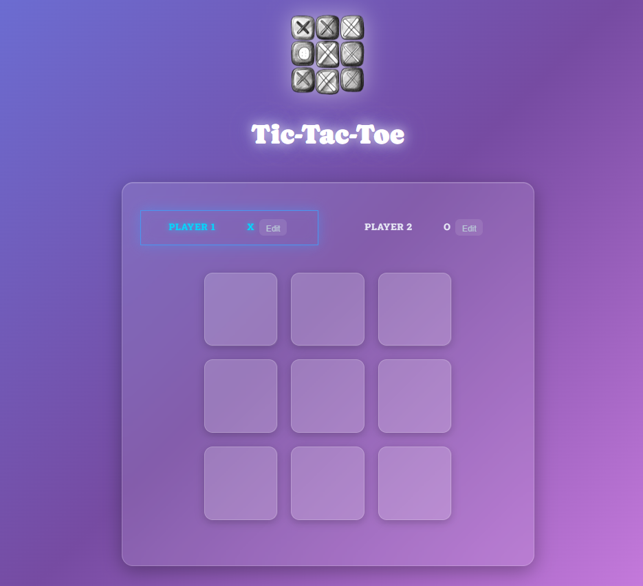

# 🎮 بازی XO مدرن - React Tic Tac Toe

<div align="center">


**یک بازی دوز (XO) مدرن و زیبا با طراحی Glassmorphism و افکت‌های Neon**

</div>

---


## ✨ ویژگی‌ها

- 🎨 **طراحی Glassmorphism مدرن** - افکت شیشه‌ای با blur و transparency
- 💫 **افکت‌های Neon Glow** - درخشش نئونی برای المان‌های فعال
- 🌈 **گرادیان‌های زیبا** - رنگ‌بندی بنفش/آبی فیروزه‌ای مدرن
- 📱 **کاملاً ریسپانسیو** - سازگار با موبایل، تبلت و دسکتاپ
- ✏️ **ویرایش نام بازیکنان** - امکان تغییر نام در حین بازی
- 🎯 **تشخیص خودکار برنده** - بررسی 8 حالت برد
- 📊 **سیستم لاگ** - ثبت تمام حرکات بازی
- 🔄 **تشخیص تساوی** - نمایش پیام Draw در پایان بازی
- 🎭 **انیمیشن‌های روان** - Smooth transitions و hover effects
- ♿ **دسترس‌پذیری** - دکمه‌های غیرفعال برای خانه‌های پر شده

---

## 🚀 تکنولوژی‌های استفاده شده

| تکنولوژی | کاربرد |
|:---|:---|
| ⚛️ **React 18+** | فریم‌ورک اصلی UI |
| 🎣 **React Hooks** | مدیریت State با useState |
| 🎨 **CSS3** | استایل‌دهی پیشرفته |
| 💎 **Glassmorphism** | طراحی مدرن UI |
| 🎬 **CSS Animations** | انیمیشن‌های روان |
| 📱 **Responsive Design** | Media Queries |

---

## 📦 نصب و راه‌اندازی

### پیش‌نیازها

- Node.js (نسخه 14 یا بالاتر)
- npm یا yarn

### مراحل نصب

1️⃣ **کلون کردن ریپازیتوری:**
```bash
git clone https://github.com/lxlnimalxl/react-tic-tac-toe.git
cd react-tic-tac-toe
```

2️⃣ **نصب وابستگی‌ها:**
```bash
npm install
# یا
yarn install
```

3️⃣ **اجرای پروژه:**
```bash
npm run dev
# یا
yarn dev
```

4️⃣ **باز کردن در مرورگر:**
```
http://localhost:5173
```

---

## 📁 ساختار پروژه

```
react-tic-tac-toe/
├── public/
│   └── favicon.ico
├── src/
│   ├── components/
│   │   ├── Player.jsx         # کامپوننت بازیکن با قابلیت ویرایش
│   │   ├── GameBoard.jsx      # صفحه بازی 3x3
│   │   └── Log.jsx            # کامپوننت لاگ حرکات
│   ├── App.jsx                # کامپوننت اصلی و مدیریت state
│   ├── App.css                # استایل‌های اصلی با Glassmorphism
│   ├── index.css              # استایل‌های سراسری
│   ├── main.jsx               # نقطه ورود React
│   └── winning-combinations.js # ترکیبات برنده
├── screenshots/               # اسکرین‌شات‌های پروژه
├── package.json
├── vite.config.js
└── README.md
```

---

## 🎮 نحوه بازی

1. **شروع بازی:** بازی با بازیکن X شروع می‌شود
2. **انتخاب خانه:** روی یکی از 9 خانه کلیک کنید
3. **تغییر نوبت:** بازیکنان به صورت خودکار عوض می‌شوند
4. **تشخیص برنده:** سه خانه در یک ردیف/ستون/قطر با یک نماد
5. **پایان بازی:** 
   - 🏆 نمایش برنده با انیمیشن
   - 🤝 اعلام تساوی اگر همه خانه‌ها پر شوند
   - 🔄 امکان شروع بازی جدید

### ویژگی‌های اضافی:
- **ویرایش نام:** روی دکمه "Edit" کلیک کنید
- **بازیکن فعال:** دور بازیکن فعال نئون آبی می‌چرخد
- **لاگ حرکات:** تمام حرکات در پایین صفحه ثبت می‌شود

---

## 🎨 اسکرین‌شات‌ها

### 🖥️ نمای گیم
<p align="center">
  
</p>

---

## 🛠️ توسعه‌دهنده

اگر می‌خواهید در پروژه مشارکت کنید:

1. Fork کنید
2. Branch جدید بسازید: `git checkout -b feature/AmazingFeature`
3. Commit کنید: `git commit -m 'Add AmazingFeature'`
4. Push کنید: `git push origin feature/AmazingFeature`
5. Pull Request باز کنید

---

## 🤝 مشارکت‌کنندگان

- 👤 **توسعه‌دهنده اصلی** - [@lxlnimalxl](https://github.com/lxlnimalxl)

---

## 📄 لایسنس

این پروژه تحت لایسنس **MIT** منتشر شده است. برای جزئیات فایل `LICENSE` را مشاهده کنید.

---

## 🙏 تشکر

- 🎨 طراحی مدرن با الهام از UI/UX trends روز
- 💡 ایده اصلی از دوره React
- ⭐ اگر پروژه رو دوست داشتید، ستاره یادتون نره!

---

<div align="center">

**ساخته شده با ❤️ و ⚛️ React**

[Report Bug](https://github.com/yourusername/react-tic-tac-toe/issues) · [Request Feature](https://github.com/yourusername/react-tic-tac-toe/issues)

</div>
